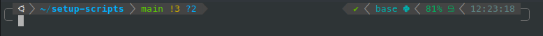

# setup-scripts
A few setup scripts, including an automatic ZSH setup with Oh My ZSH! and Powerlevel10k and a few plugins (under `setup/zsh-p10k.sh`).

Want to try this setup? Launch `try-it.sh` and let docker work its magic :)

**Pro tip**: open `byobu` and type `monitoring`, it will open up a nice three-pane window with `sensors`, `nvidia-smi` (if docker is nvidia-powered) and `htop`.

## ZSH plugins 
- [zsh-completions](https://github.com/zsh-users/zsh-completions)
- [zsh-autosuggestions](https://github.com/zsh-users/zsh-autosuggestions)
- [zsh-syntax-highlighting](https://github.com/zsh-users/zsh-syntax-highlighting)
- [history-substring-search](https://github.com/zsh-users/zsh-history-substring-search)
- [autoenv](https://github.com/zpm-zsh/autoenv)

## Powerlevel10k
[Powerlevel10k](https://github.com/romkatv/powerlevel10k) is a super cool theme which I've tweaked based on its classic style (image below).

One can always change it by running `p10k configure` within `zsh` :)